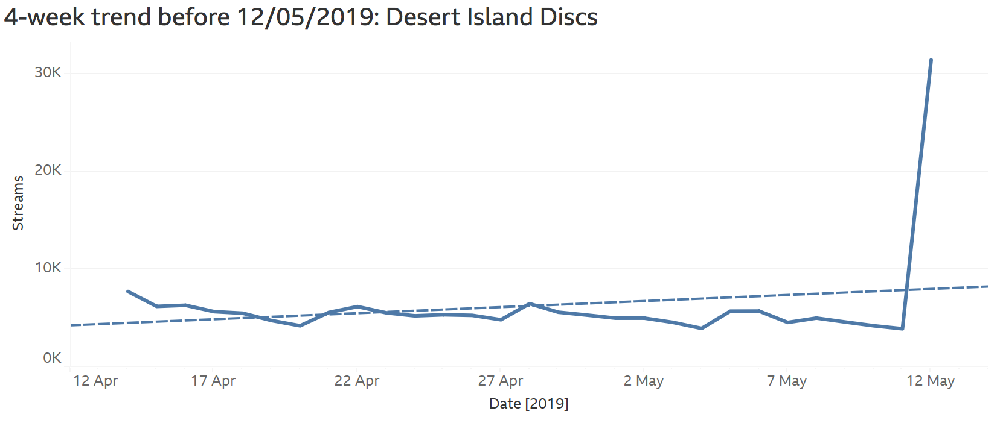

# Trending

The purpose of this project is to calculate what programmes are trending on iPlayer and Sounds.

Desert Island Discs was trending on 12 May 2019 after Louis Theroux's appearance.

## 'Most popular' vs 'trending'

These two concepts are not the same. The **most popular** programmes are simply those that have the most streams (or the highest reach) on a particular day. These are the usual suspects - EastEnders/MotD on iPlayer; The Archers/Today on Sounds.

However, **trending** programmes are those that are suddenly popular, relative to previous performance. For example, a programme might have 1k streams per day for a month, before leaping to 100k streams.

Jeremy Edberg, former Lead Reliability Engineer at Netflix, explains the difference like this:

> "Think of it like cars on the road. Popular are the cars that are moving the fastest, while trending are the cars that are accelerating the hardest…basically trending is a prediction of what is about to be popular."

## Method

What's trending is a **heuristic** concept; that is, it does not have an exact or pre-existing solution that can be validated. Instead, we are free to define it in whatever way we deem appropriate.

The current method - which is defined at both the **daily** and **hourly** level - goes something like this:

1. Calculate the number of streams for a programme on a given day
2. Minus the average number of streams for that programme over the previous 28 days
3. Divide by the standard deviation of streams for that programme over the previous 28 days

Or, as an equation:

(Streams - average of streams over previous 28 days) / Standard deviation of streams over previous 28 days

This is a equivalent to a **z-score** (aka a standard score).

## Guide to code

The code is split into two main sections: the first defines trending by day, and the second defines trending by hour.

The different files calculate what is trending for different groups/subsets of data. For example, `trending_young.sql` calculates what is trending for 16-24 year olds, while `trending_ondemand.sql` filters out live data.

The `manualinsert` files are for calculating yesterday's data and are used to update the [accompanying Tableau dashboard](https://scv-tableau.live.tools.bbc.co.uk/t/Public-Service/views/Trending/DailyView?iframeSizedToWindow=true&:embed=y&:showAppBanner=false&:display_count=no&:showVizHome=no).